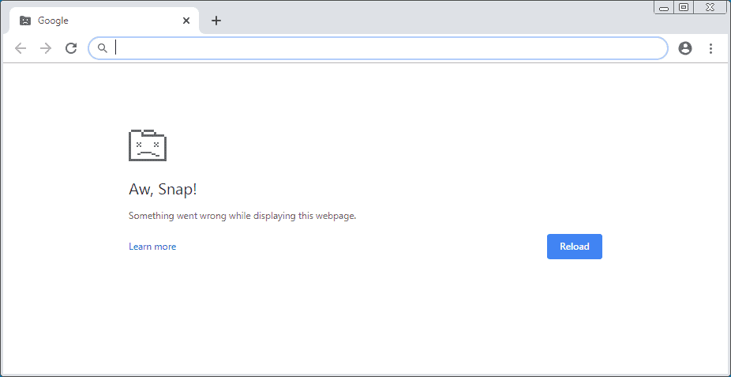

Do websites just break down when an HTML document is invalid? Not _per sé_.

Browsers don't just break down when they try to render an HTML page without 100% validity.

Crash screens in browsers such as this one:


can be caused by reasons, but almost never because an HTML was invalid.

## Browsers are lenient with HTML documents

There's probably historical and logical reasons why browsers don't error on bad HTML documents. We won't

[[Modern browsers]] have been programmed to be l, very compatible and to try to make HTML documents render, even if they're not 100% valid.

This is different JavaScript because of being a programming language instead of a markup language like :SiHtml5::

While an error happening JavaScript won't cause the page to crash, it will stop running whatever it was running.

## What happens if I don't use the `html`, `head` or `body` elements in the page?

When none of these elements are detected, modern browser will usually add that for you and render properly.

This is why placing the following code in an HTML document and opening it in a browser just works:

```
Hello World!
```
